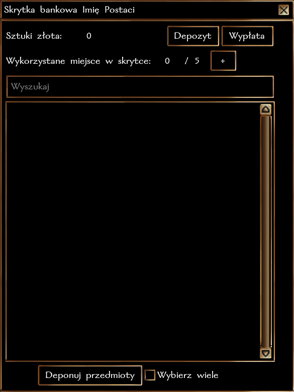

# Skrytki bankowe

*"Martwisz się o swoje środki? Kieszonkowcy nie dają ci spokoju? Mamy rozwiązanie na twój problem! Już dziś zgłoś się do oddziału naszego banku w Neverwinter i zabezpiecz swoje oszczędności i swoją przyszłość."*

## Komu przysługuje skrytka bankowa?

Każdy mieszkaniec i nowoprzybyły w mieście Neverwinter otrzymuje konto bankowe i małą skrytkę. Wystarczy udać się do oddziału banku w Żebraczym Gnieździe i porozmawiać z przedstawicielem bądź użyć skrytek otwierających indywidualne sfery kieszonkowe

## Jak funkcjonuje skrytka?

- W skrytce można **zdeponować dowolną ilość złota** a bank pobierze **1% prowizji** za dokonanie transakcji. Wystarczy wybrać "Depozyt" i wpisać wybraną sumę. Suma minus 1% pojawi się w skrytce.
- Jeśli chcesz **wypłacić środki**, bank nie pobiera już żadnych opłat. Wybierz "Wypłata" i wpisz jaką sumę chcesz pobrać. Po potwierdzeniu, pojawi się w twoim ekwipunku.
- Początkowo, w skrytce jest **miejsce na 5 przedmiotów**, lub stacków. **Uwaga! Nawet jeśli zdeponujesz dwie takie same mikstury, które nie były zestackowane - nie połączą się one w skrytce i zajmą dwa miejsca. Miej to na uwadze deponując przedmioty.**
- By zdeponować przedmiot wybierz **"Deponuj przedmioty"** i kliknij przedmiot w ekwipunku.
- Jeśli chcesz zdeponować kilka przedmiotów na raz, najpierw zaznacz **"Wybierz wiele"**.
- Jeśli chcesz **pobrać przedmiot** do ekwpiunku, po prostu kliknij na niego w skrytce. Deponowanie i pobieranie przedmiotów nie niesie ze sobą żadnych opłat.

## Dodatkowe miejsca na przedmioty
Jeśli życzysz sobie składować więcej przedmiotów w skrytce, musisz wykupić więcej miejsc. Kliknij na + przy informacji o wykorzystanych miejscach i potwierdź wykupienie dodatkowych miejsc. **Środki na zakup dodatkowych miejsc muszą się znajdować w skrytce!**

Pierwsze dodatkowe 5 miejsc kosztuje **5 000 SZ**, kolejne **20 000 SZ**. Dalej, możesz już odkryć samodzielnie.

## Dodatkowe informacje

Stan środków w skrytce nie aktualizuje się na bieżąco. Na przykład: jeśli sprzedasz przedmiot na Targowisku akurat mając otwartą skrytkę, nie zauważysz zwiększonej liczby złota. Skrytkę będzie trzeba zamknąć i ponownie otworzyć by zobaczyć aktualny stan.

Skrytek nie można przepisać na inną osobę.

Przelewy na skrytki innych osób nie są wspierane.

W przypadku śmierci właściciela, wszelkie środki i przedmioty stają się własnością banku, jeśli w ustalonym prawnie okresie nie uda się odnaleźć ostatniej woli. Wszelkie sprawy spadkowe są regulowane przez Tyrowy Sąd Najwyższy.