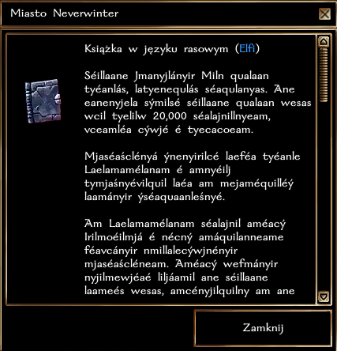

# System języków

## Dostępne języki graczy

| Komenda | Język        |
|---------|--------------|
| !dr     | Druidzki     |
| !kr     | Krasnoludzki |
| !el     | Elfi         |
| !gn     | Gnomi        |
| !ni     | Niziołczy    |
| !or     | Orczy        |

## Stopnie znajomości języka

| Znajomość | Stopień             |
|-----------|---------------------|
| 0-30      | Brak                |
| 31-60     | Początkujący        |
| 61-80     | Średniozaawansowany |
| 81-94     | Zaawansowany        |
| 95-100    | Pełna biegłość      |

## Opisy przedmiotów języku rasowym

### Przykład: Książka

Książki w języku rasowym posiadają nagłówek, który identyfikuje używany język. Poniżej książka "Miasto Neverwinter" w języku elfów. Postać, która zna dany język zobaczy przetłumaczony tekst

## Dodatkowe informacje

Używając " można wykluczyć nazwy własne w wypowiedzi postaci.