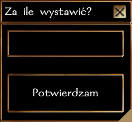

# Targowisko

## Zwiedzając Neverwinter natykasz się na Targowisko Awanturników

Jest to gildia o niejako kontrowersyjnym charakterze i jej właściciel nie jest w zbyt dobrych stosunkach ze strażą miasta. Ściąga ona masę awanturników i przygodnych podróżników, znajdując dla nich jakieś intratne zajęcia. Straży nie bardzo podoba się jak wielu obcych ściąga to miejsce, jednak właściciel upiera się że lepsze to, niż by mieli kupców po drogach rabować.

## Alistar

Jeśli jeszcze nie wiesz kto to jest, radzimy szybko temu zaradzić. Znajdziesz go właśnie na Targowisku, a każdy szanujący się poszukiwacz przygód na pewno chętnie skorzysta z jego usług - w końcu asortyment którym dysponuje jest jedyny w swoim rodzaju.

A to dlatego, że Alistar skupuje i odsprzedaje przedmioty od innych takich jak ty. Sprawdź jego ofertę! Na pewno znajdziesz coś dla siebie. A jeśli zdobędziesz jaki magiczny przedmiot, którego nie potrzebujesz, za drobną opłatą Alistair załatwi ci kupca.

## Jak działa Targowisko?

### Wystawianie na sprzedaż

Możesz wystawić **dowolny przedmiot na sprzedaż** ze swojego ekwipunku (lub stack). Wystarczy, że go przeciągniesz lub klikniesz prawym i wybierasz "Sprzedaj". Pojawi się okienko gdzie będzie można wpisać swoją cenę.

- Minimalna cena za jaką możesz coś wystawić to **100 sztuk złota**.
- Maksymalna cena - **1 000 000 sztuk złota**.

W każdej chwili możesz każdy wystawiony przedmiot **wycofać bez żadnych opłat.**

## Zysk

Kiedy ktoś zakupi twój przedmiot, otrzymasz informację w logu - zawrze ona twój bezpośredni zysk, po pobraniu prowizji przez Alistara. Prowizja wynosi 5% od wystawionej ceny.

Środki ze sprzedaży trafią do twojej **skrytki bankowej**, więc będzie trzeba się tam udać, żeby zgarnąć złoto.

## Komunikaty na Discrodzie

Na kanale [#targowisko](https://discord.com/channels/752493729289601025/1082277386927751199) na Discordzie pojawią się takie komunikaty:

- Kto wystawił przedmiot, jaki, za jaką cenę i jaki jest jego opis i właściwości
- Kiedy sprzedawca wycofał przedmiot i o jaki przedmiot chodzi
- Jaki przedmiot został sprzedany i za ile, jego poprzedni i nowy właściciel i jaką prowizję pobrał Alistar